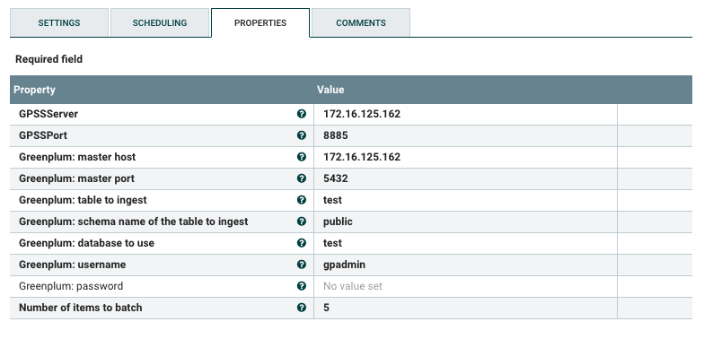
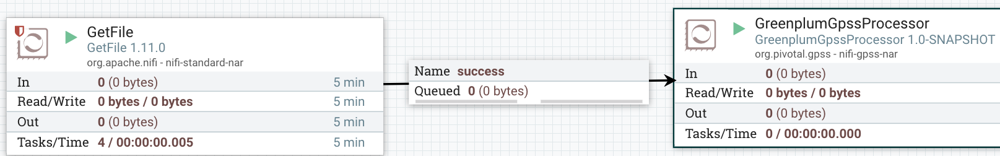

# Summary
This software is intended to be a simple (non production ready) processor for apache nifi server, using Greenplum Streaming Service functionalities. </br>
It is written in Java and it uses the following technologies: Apache nifi, java, GRPC, Greenplum GPSS. </br>
At the moment it is just supporting json format. The processor is receiving .json entries from a nifi relation and ingest in a Greenplum table.</br> 

The following reading can help you to better understand the software:

**Apache Nifi:** </br>
https://nifi.apache.org/ </br>
**GRPC:**  </br>
https://grpc.io/ </br>
**Greenplum GPSS:**</br>
https://gpdb.docs.pivotal.io/5160/greenplum-stream/overview.html</br>
https://gpdb.docs.pivotal.io/5160/greenplum-stream/api/dev_client.html</br>

These are the steps to run the software:

## Prerequisites

1. **Activate the gpss extension on the greenplum database you want to use (for example test)**
   
      ```
      test=# CREATE EXTENSION gpss;
      ```
   
2. **Create the Greenplum table to be ingested**

      Create a table with a json data field (called data)
   
      ```
      test=# create table test(data json);
      ```
   
3. **Run a gpss server with the right configuration (ex):**
  
      gpss ./gpsscfg1.json --log-dir ./gpsslogs
      where gpsscfg1.json 
  
      ```
      {
         "ListenAddress": {
            "Host": "",
            "Port": 8085,
            "SSL": false
         },
         "Gpfdist": {
            "Host": "",
            "Port": 8086
         }
      }
      ```

4. **download, install and start nifi**


  
## Deploy and test the nifi processor

1. **Copy the .nar file to the nifi lib directory** </br>

The nifi processor is written in Java. Maven will automatically create a .nar file to be deployed in nifi.
Copy the .nar file in ./nifi-gpss-nar/target/nifi-gpss-nar-1.0-SNAPSHOT.nar inside your nifi lib directory


</br> 


2. **restart nifi** </br>

Once copied restart nifi


3. **insert the processor in the nifi UI** </br>


4. **Setting property of the processor**  </br>   



Password can be null. All the other properties must be specified.</br>   
NumberOfItemsToBatch specify if the components need to batch items before ingesting. In this case is 5 so the processor needs to receive at least 5 json entries before ingesting.</br>  
For pure streaming way you can set it to 1.
    
5. **Add a GetFile processor as a tester** </br> 


</br> 


5. **Create a relashionship** </br> 


6. **Start the two processors** </br> 




7. **Put a populated json file inside the test directory you specified in the Get file** </br>  

You can copy several one line files or you can submit a file with a number of json (one every line).</br>  


</br> 


7. **Have a look to the application logs of nifi and see the greenplum tables populated** </br>


```
test=# select * from test;
                       data                        
---------------------------------------------------
 {"name": "John", "age": "31", "city": "New York"}
 {"name": "John", "age": "31", "city": "New York"}
 {"name": "John", "age": "31", "city": "New York"}
 {"name": "John", "age": "31", "city": "New York"}
 {"name": "John", "age": "31", "city": "New York"}
(5 rows)
```
